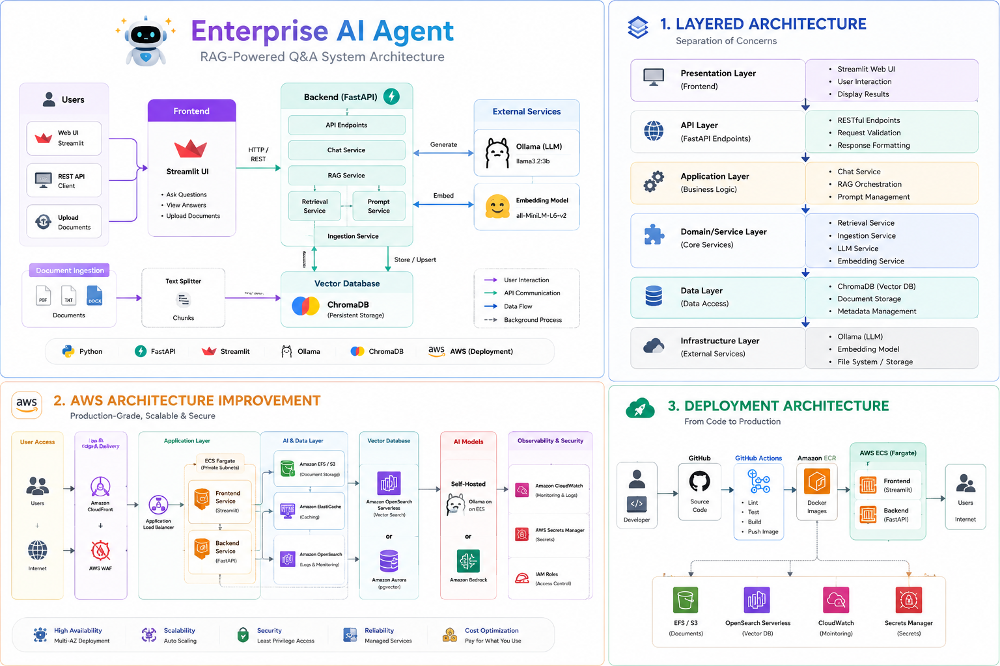
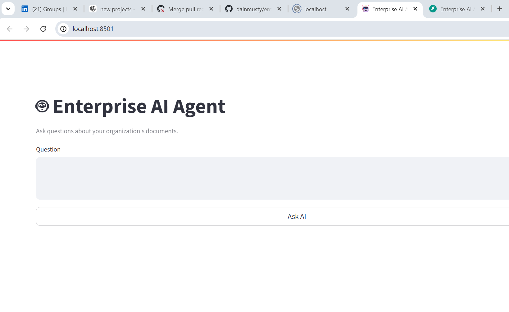
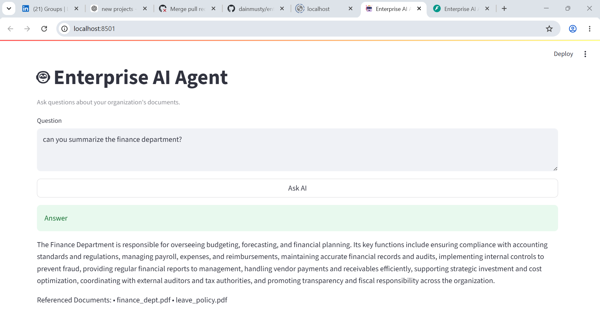
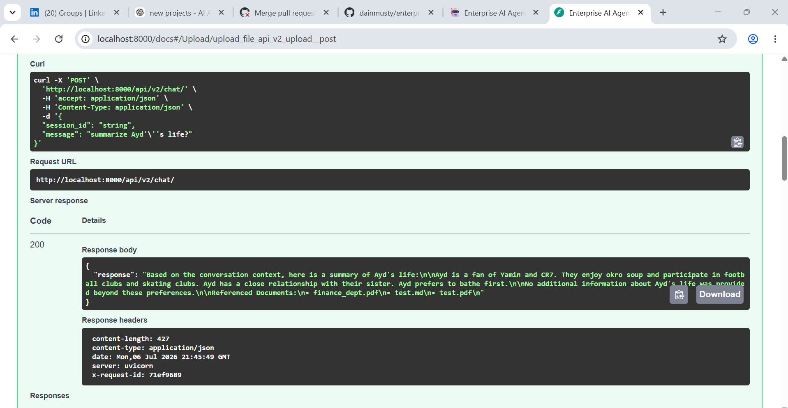
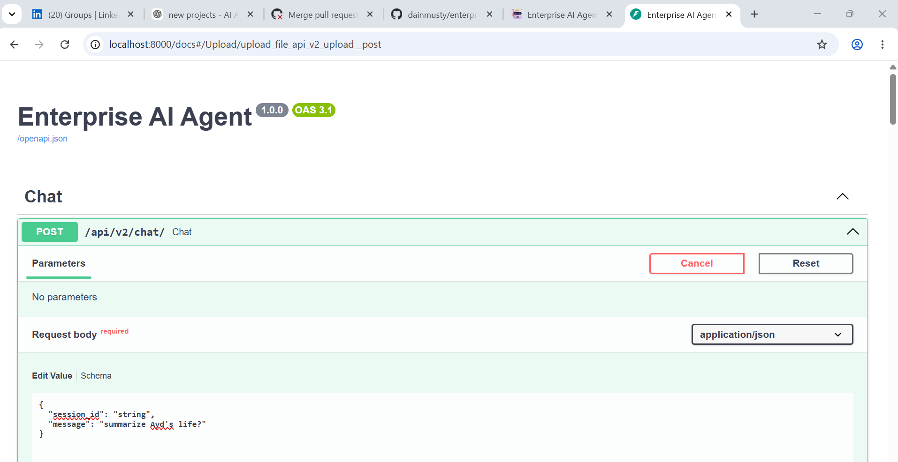
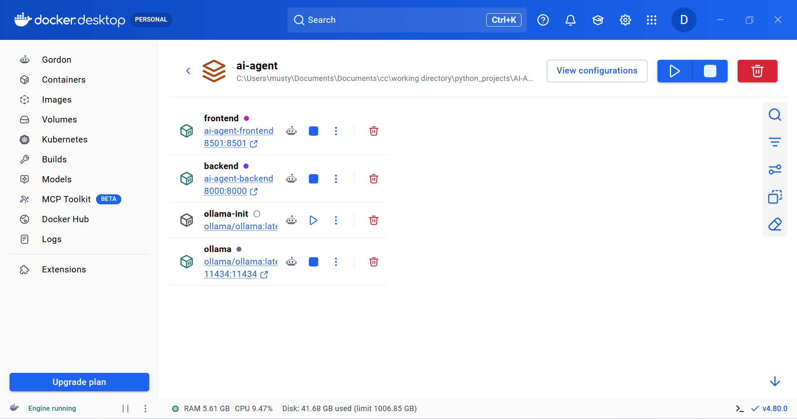

# 🤖 Enterprise RAG AI Agent

<p align="center">


</p>

<p align="center">
<b>An enterprise-grade Retrieval-Augmented Generation (RAG) AI assistant built with FastAPI, Streamlit, Ollama, ChromaDB and Docker.</b>
</p>

<p align="center">
Semantic Search • Local LLM • Enterprise Architecture • Docker • GitHub Actions • Clean Code
</p>

---

> Build once. Deploy anywhere.
>
> This project demonstrates how modern AI applications can be engineered using layered architecture, semantic search, vector databases, local Large Language Models, and containerized deployment while remaining cloud-ready for future AWS migration.


<p align="center">



</p>


## 📑 Table of Contents

- [Overview](#-overview)
- [Project Highlights](#-project-highlights)
- [Why This Project](#-why-this-project)
- [Features](#-features)
- [Architecture](#-architecture)
- [Technology Stack](#-technology-stack)
- [Project Structure](#-project-structure)
- [Retrieval-Augmented Generation (RAG) Pipeline](#-retrieval-augmented-generation-rag-pipeline)
- [Document Processing Pipeline](#-document-processing-pipeline)
- [Screenshots](#-screenshots)
- [Quick Start](#-quick-start)
- [Running with Docker](#-running-with-docker)
- [API Documentation](#-api-documentation)
- [CI/CD Pipeline](#-cicd-pipeline)
- [Future AWS Enhancements](#-future-aws-enhancements)
- [Skills Demonstrated](#-skills-demonstrated)
- [Contributing](#-contributing)
- [License](#-license)


## ✨ Project Highlights

This project showcases the design and implementation of an enterprise-grade Retrieval-Augmented Generation (RAG) platform using modern software engineering and AI development practices.

### Highlights

- 🤖 Enterprise AI Assistant powered by a local Llama 3.2 model using Ollama
- 🔍 Semantic document search with Sentence Transformers and ChromaDB
- 📄 Multi-format document ingestion (PDF, Markdown, Text)
- 🧠 Retrieval-Augmented Generation (RAG) for context-aware responses
- 🏗️ Clean layered architecture with separation of concerns
- ⚡ FastAPI REST backend with automatic OpenAPI documentation
- 🌐 Interactive Streamlit web interface
- 🐳 Fully containerized with Docker Compose
- 🔄 Automated CI pipeline using GitHub Actions
- 📦 Automatic document chunking, embedding generation, and vector indexing
- 🔒 Designed with enterprise deployment patterns and cloud portability in mind
- ☁️ Architecture intentionally structured for future AWS deployment with minimal refactoring


## 💡 Why This Project

Many AI demos stop at connecting a chatbot to an API. Real enterprise AI systems, however, require much more than simply generating responses.

This project was built to demonstrate how a production-oriented AI platform can be engineered using clean architecture principles, modular services, semantic search, vector databases, containerization, and automated deployment pipelines.

Rather than relying on hosted AI services, the application uses a locally hosted Llama 3.2 model through Ollama, providing complete control over data privacy while showcasing how Retrieval-Augmented Generation (RAG) can deliver accurate, context-aware answers from organizational documents.

The architecture intentionally separates presentation, application, AI services, infrastructure, and data layers, making the solution maintainable, testable, and easy to extend.

Although the current implementation runs entirely with Docker for simplicity and portability, the project has been designed so it can be migrated to AWS using services such as Amazon ECS, Amazon ECR, OpenSearch Serverless, Application Load Balancer, CloudWatch, and Terraform with minimal architectural changes.

This repository demonstrates not only AI integration, but also enterprise software engineering, backend architecture, DevOps practices, and cloud-ready application design.


## 🚀 Features

### 🤖 AI & Retrieval-Augmented Generation (RAG)

- Retrieval-Augmented Generation (RAG) powered by a local LLM
- Semantic document search using Sentence Transformers
- Local Llama 3.2 model served through Ollama
- ChromaDB vector database for embedding storage and retrieval
- Context-aware prompt construction for accurate responses
- Automatic embedding generation during document ingestion
- Configurable retrieval of top-k relevant document chunks
- Source attribution showing referenced documents in responses

---

### 📄 Document Processing

- Upload documents through the REST API
- Automatic document ingestion and indexing
- Supports multiple file formats:
  - PDF
  - Markdown (.md)
  - Plain Text (.txt)
- Intelligent document chunking for improved retrieval accuracy
- Metadata generation for indexed documents
- Duplicate-resistant document indexing using hashed identifiers

---

### ⚙️ Backend Services

- FastAPI REST API
- Layered architecture with clear separation of concerns
- Modular service-based design
- Automatic OpenAPI (Swagger) documentation
- Configuration management using environment variables
- Centralized logging and request middleware
- Global exception handling
- Health check endpoint
- Session-aware API design for future conversational memory support

---

### 🌐 Frontend

- Interactive Streamlit web interface
- Simple document question-and-answer workflow
- Loading indicators during inference
- Clean and responsive user experience
- Displays referenced documents alongside AI responses

---

### 🐳 DevOps & Deployment

- Fully containerized using Docker
- Multi-container orchestration with Docker Compose
- Automatic Ollama model initialization during startup
- GitHub Actions Continuous Integration workflow
- Environment-based configuration
- Persistent storage using Docker volumes
- Easy local deployment with a single command


## 🚀 Architecture

- Clean layered architecture
- Modular project structure
- Easily extensible service components
- Cloud-ready design
- Designed for future AWS deployment
- Portable infrastructure suitable for Kubernetes or container platforms
- Separation of business logic, AI services, infrastructure, and presentation layers

Designed to demonstrate practical skills in AI Engineering, Backend Development, DevOps, Clean Architecture, and Cloud-Native Application Design.


# Overall System Architecture
                    +---------------------------+
                    |      Streamlit UI         |
                    +-------------+-------------+
                                  |
                                  v
                    +---------------------------+
                    |       FastAPI API         |
                    +-------------+-------------+
                                  |
          +-----------------------+-----------------------+
          |                                               |
          v                                               v
+----------------------+                     +------------------------+
|   Chat Service       |                     |  Upload Service        |
+----------------------+                     +------------------------+
          |                                               |
          +-----------------------+-----------------------+
                                  |
                                  v
                    +---------------------------+
                    |      RAG Service          |
                    +-------------+-------------+
                                  |
                +-----------------+------------------+
                |                                    |
                v                                    v
      +---------------------+            +----------------------+
      | Embedding Service   |            |     LLM Service      |
      +----------+----------+            +----------+-----------+
                 |                                    |
                 v                                    v
         +---------------+                 +----------------------+
         | ChromaDB      |                 | Ollama (Llama 3.2)   |
         | Vector Store  |                 | Local LLM            |
         +---------------+                 +----------------------+


## ✨ Technology Stack

| Layer                   | Technology                               | Purpose                                                      |
| ----------------------- | ---------------------------------------- | ------------------------------------------------------------ |
| **Frontend**            | Streamlit                                | Interactive web interface for chatting with the AI assistant |
| **Backend API**         | FastAPI                                  | High-performance REST API for chat and document ingestion    |
| **LLM**                 | Ollama                                   | Runs local Large Language Models without cloud dependencies  |
| **Language Model**      | Llama 3.2 (3B)                           | Generates context-aware responses from retrieved knowledge   |
| **Embeddings**          | Sentence Transformers (all-MiniLM-L6-v2) | Converts text into semantic vector embeddings                |
| **Vector Database**     | ChromaDB                                 | Stores embeddings and performs semantic similarity search    |
| **Document Processing** | PyPDF, Markdown, Text Loaders            | Extracts content from PDF, Markdown, and text documents      |
| **AI Pattern**          | Retrieval-Augmented Generation (RAG)     | Grounds LLM responses using enterprise documents             |
| **Containerization**    | Docker & Docker Compose                  | Consistent local development and deployment                  |
| **CI/CD**               | GitHub Actions                           | Automated linting, builds, testing, and deployment workflows |
| **Language**            | Python 3.12                              | Primary application language                                 |
| **API Documentation**   | Swagger / OpenAPI                        | Interactive API testing and documentation                    |
| **Version Control**     | Git & GitHub                             | Source control and collaboration                             |


# Core Components         
| Component                      | Description                                                             |
| ------------------------------ | ----------------------------------------------------------------------- |
| **Frontend**                   | Streamlit application providing a simple conversational interface       |
| **Backend**                    | FastAPI service exposing REST endpoints for chat and document ingestion |
| **Embedding Engine**           | Generates semantic embeddings for uploaded documents                    |
| **Retriever**                  | Performs vector similarity search against ChromaDB                      |
| **Prompt Builder**             | Combines retrieved context with the user's question                     |
| **LLM Service**                | Sends prompts to Ollama and returns generated answers                   |
| **Document Ingestion Service** | Parses, chunks, embeds, and indexes uploaded documents                  |
| **Vector Store**               | ChromaDB collection containing enterprise knowledge                     |


# Configuration
| Variable            | Description                         |
| ------------------- | ----------------------------------- |
| `OLLAMA_BASE_URL`   | Ollama server endpoint              |
| `LLM_MODEL`         | Language model to load              |
| `EMBEDDING_MODEL`   | Sentence Transformer model          |
| `TOP_K_RESULTS`     | Number of document chunks retrieved |
| `CHUNK_SIZE`        | Maximum chunk size during ingestion |
| `CHUNK_OVERLAP`     | Overlap between adjacent chunks     |
| `CHROMA_COLLECTION` | ChromaDB collection name            |


# End-to-End Technology Flow
                User
                  │
                  ▼
          Streamlit Frontend
                  │
                  ▼
             FastAPI Backend
                  │
        ┌─────────┴──────────┐
        ▼                    ▼
Document Ingestion      Chat Request
        │                    │
        ▼                    ▼
Document Loader      Embedding Generator
        │                    │
        ▼                    ▼
Text Chunking        ChromaDB Search
        │                    │
        ▼                    ▼
Embedding Model     Retrieved Context
        │                    │
        └─────────┬──────────┘
                  ▼
           Prompt Construction
                  │
                  ▼
          Ollama (Llama 3.2)
                  │
                  ▼
          AI Generated Answer
                  │
                  ▼
           Streamlit Response


## ✨ Project Structure

enterprise-rag-ai-agent/
│
├── backend/
│   ├── app/
│   │   ├── api/               # FastAPI REST endpoints
│   │   ├── clients/           # External service clients (Ollama, ChromaDB, Embeddings)
│   │   ├── core/              # Configuration, middleware, logging
│   │   ├── loaders/           # PDF, Markdown and Text document loaders
│   │   ├── models/            # Request and response models
│   │   ├── services/          # Business logic and RAG pipeline
│   │   ├── utils/             # Chunking, hashing and helper utilities
│   │   └── main.py            # FastAPI application entry point
│   │
│   ├── chroma_db/             # Local ChromaDB storage (generated)
│   ├── Dockerfile
│   └── requirements.txt
│
├── frontend/
│   ├── app.py                 # Streamlit user interface
│   ├── Dockerfile
│   └── requirements.txt
│
├── data/
│   ├── uploads/               # Uploaded enterprise documents
│   ├── security/              # Example security documentation
│   └── *.pdf / *.md / *.txt
│
├── docs/
│   ├── layered-architecture.md
│   ├── deployment-architecture.md
│   ├── aws-architecture-improvement.md
│   ├── layered-architecture.png
│   ├── deployment-architecture.png
│   └── aws-architecture-improvement.png
│
├── .github/
│   └── workflows/
│       └── ci.yml             # GitHub Actions CI pipeline
│
├── docker-compose.yml
├── .env.example
├── .gitignore
├── LICENSE
└── README.md


# Backend Architecture
| Package      | Responsibility                                               |
| ------------ | ------------------------------------------------------------ |
| **api**      | REST endpoints and request handling                          |
| **clients**  | Communication with Ollama, ChromaDB, and embedding models    |
| **core**     | Configuration, middleware, logging, and application settings |
| **loaders**  | Extracts text from PDF, Markdown, and text files             |
| **models**   | Pydantic request and response schemas                        |
| **services** | RAG pipeline, ingestion pipeline, and business logic         |
| **utils**    | Text chunking, hashing, and reusable helper functions        |

# Document Lifecycle
Upload Document
      │
      ▼
Document Loader
      │
      ▼
Text Extraction
      │
      ▼
Chunking
      │
      ▼
Embedding Generation
      │
      ▼
ChromaDB Index
      │
      ▼
Ready for Semantic Search

# Request Lifecycle
User Question
      │
      ▼
Streamlit UI
      │
      ▼
FastAPI Endpoint
      │
      ▼
RAG Service
      │
      ▼
Embedding Search
      │
      ▼
Retrieve Relevant Context
      │
      ▼
Prompt Construction
      │
      ▼
Ollama (Llama 3.2)
      │
      ▼
Generated Response
      │
      ▼
Streamlit UI

# Design Principles
This project was designed around several software engineering best practices:

Layered Architecture to separate presentation, business logic, and infrastructure concerns.
Single Responsibility Principle (SRP) so each module has one clear purpose.
Dependency Injection through service composition, improving modularity and testability.
Containerized Development using Docker for consistent environments.
Configuration via Environment Variables, avoiding hardcoded values.
Cloud-Ready Design, allowing local components to be replaced with managed AWS services with minimal code changes.


## ✨ Retrieval-Augmented Generation (RAG) Pipeline

The Enterprise AI Agent uses a Retrieval-Augmented Generation (RAG) architecture to provide accurate, context-aware responses grounded in your organization's documents.

Instead of relying solely on the language model's pre-trained knowledge, the application retrieves the most relevant document snippets and injects them into the prompt before generating an answer. This approach reduces hallucinations, improves factual accuracy, and allows the assistant to answer questions about proprietary information.

# End-to-End RAG Workflow
                    User Question
                          │
                          ▼
              Generate Question Embedding
                          │
                          ▼
         Semantic Similarity Search (ChromaDB)
                          │
                          ▼
           Retrieve Top-K Relevant Chunks
                          │
                          ▼
         Build Context-Aware Prompt Template
                          │
                          ▼
              Ollama (Llama 3.2 Local LLM)
                          │
                          ▼
              Generate Grounded Response
                          │
                          ▼
          Return Answer + Referenced Documents


⚙️ Step 1 — Document Ingestion

When documents are uploaded, they are processed before becoming searchable.

The ingestion pipeline:

Reads PDF, Markdown, and text documents.
Extracts raw text.
Splits the content into manageable chunks.
Generates semantic embeddings using Sentence Transformers.
Stores embeddings and metadata in ChromaDB.

This process transforms unstructured documents into a searchable knowledge base.

🔎 Step 2 — Semantic Retrieval

When a user submits a question:

The question is converted into a vector embedding.
ChromaDB performs a similarity search.
The most relevant document chunks are retrieved.
Each retrieved chunk includes metadata such as:
Document name
Chunk number
Source information

Unlike keyword search, semantic retrieval identifies content based on meaning rather than exact wording.

📝 Step 3 — Prompt Construction

The retrieved document chunks are combined with the user's question to build a structured prompt.

The language model is instructed to:

Answer only from the supplied context.
Avoid making up information.
State when the answer cannot be found.
Reference the supporting documents.

This grounding significantly improves response reliability.

🤖 Step 4 — Response Generation

The prompt is sent to the locally hosted Llama 3.2 model running in Ollama.

The model generates a natural-language answer using only the retrieved context, ensuring responses remain aligned with the indexed enterprise knowledge.

📄 Step 5 — Referenced Documents

To improve transparency and trust, each response includes the names of the documents that contributed to the answer.

Example:

Referenced Documents:
• finance_dept.pdf
• leave_policy.pdf

This allows users to verify where the information originated without exposing internal file paths.

🎯 Why Use RAG?

Compared with a traditional chatbot, a RAG-based assistant offers several advantages:

Traditional LLM	                                RAG-Based AI Assistant
Relies on pre-trained knowledge	                Uses your organization's latest documents
May hallucinate facts	                          Grounds answers in retrieved context
Cannot answer organization-specific questions	  Responds using indexed enterprise knowledge
Requires retraining for new information	        New documents become searchable after ingestion
Limited transparency	                          Returns referenced source documents


💡 Key Benefits of This Implementation
📚 Supports PDF, Markdown, and text documents.
🔍 Semantic search with ChromaDB for meaning-based retrieval.
🧠 Local Llama 3.2 model via Ollama—no external AI APIs required.
🛡️ Enterprise-friendly design with data remaining on your infrastructure.
📄 Responses include referenced documents for traceability.
🧩 Modular architecture, making it easy to swap components such as the vector database or language model.


## ✨ Document Processing Pipeline
Before users can query organizational knowledge, documents must be transformed into a searchable semantic index. The Enterprise AI Agent automatically processes uploaded files through an ingestion pipeline that extracts text, generates embeddings, and stores vector representations in ChromaDB.

This pipeline ensures that newly uploaded documents become immediately available for semantic search without requiring model retraining.


# Document Processing Workflow

                Upload Document
                      │
                      ▼
            Detect Supported Format
                      │
                      ▼
             Extract Document Text
                      │
                      ▼
               Clean & Normalize
                      │
                      ▼
              Split into Chunks
                      │
                      ▼
      Generate Semantic Embeddings
                      │
                      ▼
        Store Vectors in ChromaDB
                      │
                      ▼
          Ready for Semantic Search


#           
📥 Step 1 — Document Upload

Documents can be uploaded through the application's ingestion endpoint or placed into the data directory for batch indexing.

Supported formats include:

📄 PDF
📝 Markdown (.md)
📃 Plain Text (.txt)

The modular loader architecture makes it straightforward to add support for additional formats such as:

Microsoft Word (.docx)
Excel (.xlsx)
HTML
CSV
Email archives
📖 Step 2 — Text Extraction

Each document is parsed using the appropriate loader based on its file type.

The extracted text is normalized to remove unnecessary formatting while preserving the original content.

At this stage, no AI processing occurs—the objective is simply to obtain clean textual data for indexing.

✂️ Step 3 — Intelligent Chunking

Large documents are divided into smaller overlapping chunks before embedding.

Example:
Chunk 1
─────────────────────
Company Leave Policy...

Chunk 2
─────────────────────
Annual leave requests...

Chunk 3
─────────────────────
Medical leave...

Chunking provides several benefits:

Improves retrieval accuracy.
Reduces token usage.
Preserves contextual continuity.
Enables precise semantic matching.

The application uses configurable chunk sizes and overlap values, allowing the indexing strategy to be tuned for different document types.


🧠 Step 4 — Embedding Generation

Each text chunk is converted into a high-dimensional vector using the Sentence Transformers embedding model.

Rather than storing plain text for searching, the system stores numerical vector representations that capture semantic meaning.

This enables searches based on intent and context rather than exact keyword matches.

🗄️ Step 5 — Vector Storage

Embeddings, document chunks, and metadata are stored in ChromaDB.

Each indexed chunk includes metadata such as:

Document name
File type
Chunk number

This metadata is later used to generate the Referenced Documents section returned with every answer.

🔍 Step 6 — Search Ready

Once indexing is complete, documents immediately become part of the organization's searchable knowledge base.

No model retraining or application restart is required.

New documents are automatically available for future queries through the RAG pipeline.

📊 Processing Lifecycle
Raw Document
      │
      ▼
 Text Extraction
      │
      ▼
  Chunking
      │
      ▼
 Embedding Generation
      │
      ▼
 Vector Storage
      │
      ▼
 Semantic Retrieval
      │
      ▼
 LLM Response Generation


✨ Design Highlights

The document processing pipeline was designed with enterprise scalability and maintainability in mind.

Key characteristics include:

📄 Multi-format document support.
🔄 Automatic ingestion and indexing.
✂️ Configurable chunk size and overlap.
🧠 Semantic embeddings for meaning-based retrieval.
🗄️ Persistent vector storage using ChromaDB.
📁 Metadata-driven document traceability.
⚡ Immediate availability of newly indexed content.
🧩 Extensible architecture for adding new document loaders or embedding models.
🚀 Enterprise Benefits

This ingestion architecture provides several practical advantages for enterprise knowledge management:

New policies and procedures can be indexed without retraining the AI model.
Knowledge bases remain up to date as documents evolve.
Semantic search improves discoverability across large document collections.
Referenced source documents enhance transparency and user trust.
The modular design supports future integration with cloud object storage, enterprise document repositories, or automated ingestion workflows.


## ✨ Screenshots

The following screenshots showcase the Enterprise AI Agent from the end-user experience through to the underlying APIs and deployment environment.

1. Enterprise AI Assistant
The Streamlit web interface provides a simple conversational experience for querying organizational knowledge. Users submit natural-language questions and receive grounded responses with referenced documents.
Why it matters: Demonstrates the complete user experience and AI capabilities.



2. AI Response with Referenced Documents
Responses are generated using Retrieval-Augmented Generation (RAG) and include the documents that contributed to the answer, improving transparency and trust.



3. Document Upload & Knowledge Base
Demonstrates how enterprise documents are uploaded, indexed, and made immediately searchable without retraining the language model.



4. Swagger API Documentation

The FastAPI backend automatically generates interactive API documentation for testing chat and document ingestion endpoints.



5. Docker Compose Deployment

Shows the complete containerized application running locally.

Containers include:

Frontend (Streamlit)
Backend (FastAPI)
Ollama
Ollama Model Initializer



## 🚀 Quick Start

### Prerequisites

Ensure the following tools are installed:

| Tool | Version |
|------|---------|
| Python | 3.12+ |
| Docker | Latest |
| Docker Compose | Latest |
| Git | Latest |

Clone the repository:

```bash
git clone https://github.com/<your-username>/enterprise-rag-ai-agent.git
cd enterprise-rag-ai-agent
```

Create the environment file:

```bash
cp .env.example .env
```

Build and start the application:

```bash
docker compose up --build
```

The first startup automatically downloads the required Ollama model (`llama3.2:3b`). This is a one-time operation and may take several minutes depending on your internet connection.

Once all containers are running, access the application:

| Service | URL |
|---------|-----|
| Streamlit UI | http://localhost:8501 |
| FastAPI | http://localhost:8000 |
| Swagger UI | http://localhost:8000/docs |
| Ollama | http://localhost:11434 |

---

### Verify the Deployment

Check that all containers are healthy:

```bash
docker compose ps
```

Expected output:

```text
enterprise-ai-backend     Up
enterprise-ai-frontend    Up
enterprise-ai-ollama      Up (healthy)
```

Verify the backend health endpoint:

```bash
curl http://localhost:8000/health
```

Expected response:

```json
{
  "status": "UP"
}
```

Verify the Ollama model:

```bash
docker compose exec ollama ollama list
```

Expected output:

```text
llama3.2:3b
```

You are now ready to upload enterprise documents and begin asking questions through the Streamlit interface or the REST API.

# **Next Step:** 
Upload enterprise documents through the upload API or place supported documents in the `data/` directory before querying the AI assistant.


## 🐳 Docker Deployment

The application is fully containerized using Docker Compose, allowing the complete AI platform to be launched with a single command.

### Services

| Service | Purpose |
|----------|---------|
| **frontend** | Streamlit web application |
| **backend** | FastAPI REST API and RAG engine |
| **ollama** | Local Large Language Model (LLM) inference server |
| **ollama-init** | Automatically downloads the required Llama model on first startup |

---

### Start the Application

Build and launch all services:

```bash
docker compose up --build
```

Run in the background:

```bash
docker compose up -d --build
```

Stop the application:

```bash
docker compose down
```

---

### Automatic Model Provisioning

On the first startup, the `ollama-init` service automatically downloads the required language model:

```text
llama3.2:3b
```

This is a one-time operation. Because the Ollama data is stored in a persistent Docker volume, the model is reused on subsequent restarts.

Verify the installed model:

```bash
docker compose exec ollama ollama list
```

Example output:

```text
NAME
llama3.2:3b
```

---

### Persistent Storage

The deployment uses Docker volumes and bind mounts to preserve application data.

| Storage | Purpose |
|----------|---------|
| `ollama_data` | Stores downloaded LLM models |
| `backend/chroma_db` | Stores ChromaDB vector database |
| `data/` | Enterprise documents for ingestion |

This ensures models and vector embeddings remain available between container restarts.

---

### Verify Deployment

Confirm all containers are running:

```bash
docker compose ps
```

Example:

```text
enterprise-ai-backend
enterprise-ai-frontend
enterprise-ai-ollama
enterprise-ai-ollama-init
```

Check backend health:

```bash
curl http://localhost:8000/health
```

Expected response:

```json
{
  "status": "UP"
}
```

Open the application:

| Service | URL |
|----------|-----|
| Streamlit | http://localhost:8501 |
| Swagger UI | http://localhost:8000/docs |
| FastAPI | http://localhost:8000 |
| Ollama | http://localhost:11434 |

---

### Viewing Logs

View logs for all services:

```bash
docker compose logs
```

Backend only:

```bash
docker compose logs backend
```

Frontend only:

```bash
docker compose logs frontend
```

Ollama:

```bash
docker compose logs ollama
```

Follow logs in real time:

```bash
docker compose logs -f
```

---

### Rebuilding Containers

If dependencies or source code change, rebuild the application:

```bash
docker compose down

docker compose up --build
```

To rebuild without using cached layers:

```bash
docker compose build --no-cache

docker compose up
```

---

### Deployment Workflow

```text
Clone Repository
        │
        ▼
docker compose up --build
        │
        ▼
Ollama Starts
        │
        ▼
Model Download (First Run Only)
        │
        ▼
FastAPI Starts
        │
        ▼
Streamlit Starts
        │
        ▼
Upload Documents
        │
        ▼
Generate Embeddings
        │
        ▼
Semantic Search Ready
```


---

## 📚 API Documentation

The backend exposes a RESTful API built with **FastAPI**.

Once the application is running, interactive API documentation is automatically available.

| Documentation | URL |
|--------------|-----|
| Swagger UI | http://localhost:8000/docs |
| ReDoc | http://localhost:8000/redoc |
| OpenAPI JSON | http://localhost:8000/openapi.json |

---

## Main Endpoints

### Health Check

```http
GET /health
```

Response

```json
{
  "status": "UP"
}
```

---

### Chat with the AI

```http
POST /api/v2/chat
```

Request

```json
{
  "session_id": "demo",
  "message": "What does the leave policy say?"
}
```

Response

```json
{
  "response": "The Leave Policy Summary outlines employee leave entitlements, approval workflow, advance notice requirements, medical certificate requirements, and unused annual leave.\n\nReferenced Documents:\n• leave_policy.pdf"
}
```

---

### Upload a Document

```http
POST /api/v2/upload
```

Supported file types

- PDF
- Markdown (.md)
- Text (.txt)

Uploaded documents are automatically:

1. Parsed
2. Chunked
3. Embedded
4. Indexed into ChromaDB
5. Available for semantic search

---

## ✨ API Documentation

FastAPI automatically generates:

- Interactive Swagger UI
- ReDoc documentation
- OpenAPI Specification

No additional configuration is required.

---

## Example Workflow

```text
Upload Document
        │
        ▼
POST /api/v2/upload
        │
        ▼
Document Indexed
        │
        ▼
POST /api/v2/chat
        │
        ▼
Answer Returned with Referenced Documents
```

---

---

## 🚀 CI/CD Pipeline

The project includes a GitHub Actions workflow that automatically validates every pull request and push to the repository.

Although this portfolio project is designed for local execution using Docker Compose, the CI pipeline demonstrates how enterprise teams automate quality checks before deployment.

## Pipeline Overview

```text
Developer Push
        │
        ▼
 GitHub Actions
        │
        ├── Checkout Repository
        │
        ├── Set up Python
        │
        ├── Install Dependencies
        │
        ├── Lint Code
        │
        ├── Build Backend Docker Image
        │
        ├── Build Frontend Docker Image
        │
        ├── Verify Docker Compose Configuration
        │
        └── Pipeline Complete
```

## Automated Checks

- ✅ Repository checkout
- ✅ Python environment setup
- ✅ Dependency installation
- ✅ Static code validation
- ✅ Backend Docker image build
- ✅ Frontend Docker image build
- ✅ Docker Compose validation
- ✅ Build verification

## Why CI Matters

Continuous Integration helps ensure that:

- New code does not break existing functionality.
- Docker images continue to build successfully.
- Application dependencies remain compatible.
- Every change is automatically validated before merging.

This approach mirrors modern DevOps practices used across cloud-native engineering teams.

> **Future Enhancement:** The pipeline can easily be extended to publish Docker images to Amazon ECR and deploy automatically to AWS using Terraform, Amazon ECS, or Amazon EKS.


## ☁️ Future AWS Enhancements

Although this project is intentionally designed to run entirely on a local machine using Docker Compose, its modular architecture makes it straightforward to evolve into a cloud-native, enterprise AI platform.

The separation between the presentation layer, API layer, RAG services, and infrastructure components allows each service to be containerized and deployed independently.

## Planned Enterprise Enhancements

### ☁️ Compute & Container Orchestration

- Amazon EKS for Kubernetes orchestration
- Amazon ECS (Fargate) as a serverless container alternative
- Horizontal Pod Autoscaling
- Karpenter for intelligent node scaling

---

### 🚀 CI/CD & GitOps

- GitHub Actions for automated testing and image builds
- Amazon ECR for container image storage
- Helm charts for Kubernetes packaging
- Argo CD for GitOps-based continuous deployment

---

### 🧠 AI & Vector Search

- Amazon OpenSearch Serverless (Vector Engine)
- Amazon Bedrock support for managed foundation models
- Hybrid retrieval strategies
- Model routing between local and cloud LLMs

---

### 📁 Enterprise Storage

- Amazon S3 for document storage
- Amazon EFS for shared application storage
- Lifecycle policies for archived documents

---

### 🔐 Security

- AWS IAM Roles for Service Accounts (IRSA)
- AWS Secrets Manager
- AWS KMS encryption
- Private networking
- Fine-grained RBAC

---

### 📊 Observability

- Amazon CloudWatch
- Prometheus
- Grafana
- Loki
- OpenTelemetry distributed tracing

---

### 🌍 Enterprise Networking

- Application Load Balancer
- AWS Load Balancer Controller
- ExternalDNS
- Route 53
- AWS Certificate Manager (ACM)

---

### 🏗️ Infrastructure as Code

- Terraform modules
- Multi-environment deployments (Development, UAT, Production)
- Remote state management
- Reusable GitHub Actions workflows

---

This repository intentionally focuses on building a production-ready Retrieval-Augmented Generation (RAG) application locally before introducing cloud infrastructure.

A future companion project will demonstrate the complete enterprise deployment of this application on AWS using Terraform, Amazon EKS, Helm, GitHub Actions, and Argo CD while preserving the same clean architecture presented here.


## 🎯 Skills Demonstrated

This project showcases practical experience across AI Engineering, Backend Development, Cloud-Native Design, DevOps, and Platform Engineering.

| Category | Skills Demonstrated |
|----------|---------------------|
| **Programming** | Python 3.12, Object-Oriented Programming (OOP), Modular Development, Clean Code |
| **Backend Development** | FastAPI, REST API Design, Dependency Injection, Request Validation, Middleware, Exception Handling |
| **Artificial Intelligence** | Retrieval-Augmented Generation (RAG), Prompt Engineering, Local LLM Integration, Semantic Search |
| **Machine Learning** | Sentence Transformers, Embedding Generation, Vector Similarity Search |
| **Vector Databases** | ChromaDB, Document Indexing, Metadata Management, Context Retrieval |
| **Document Processing** | PDF Parsing, Markdown Processing, Text Extraction, Chunking Strategies |
| **Frontend** | Streamlit, Interactive Dashboards, User Experience Design |
| **Software Architecture** | Layered Architecture, Separation of Concerns, Service-Oriented Design, Modular Components |
| **API Development** | RESTful Services, JSON APIs, OpenAPI (Swagger), Client-Server Communication |
| **Containerization** | Docker, Docker Compose, Multi-Container Applications |
| **CI/CD** | GitHub Actions, Automated Builds, Linting, Container Image Pipelines |
| **Testing & Debugging** | API Testing, Log Analysis, Troubleshooting, Container Debugging |
| **Security** | Environment Variables, Configuration Management, Local AI Deployment, Secure Service Communication |
| **Documentation** | Architecture Diagrams, Technical Documentation, API Documentation, Project Documentation |
| **Cloud Readiness** | AWS Migration Planning, Kubernetes Readiness, GitOps Architecture, Infrastructure as Code Design |

---

### 💼 Engineering Practices Demonstrated

- Enterprise application architecture
- Clean Architecture principles
- Separation of concerns
- Dependency injection
- Service abstraction
- Container-first development
- Infrastructure-ready application design
- Production-oriented logging
- Configuration management
- Modular and maintainable codebase
- Documentation-driven development
- AI application lifecycle management

---

### 🚀 Ideal Roles

This project demonstrates skills relevant to roles such as:

- AI Platform Engineer
- Platform Engineer
- DevOps Engineer
- Site Reliability Engineer (SRE)
- Cloud Engineer
- Backend Python Developer
- MLOps Engineer
- Infrastructure Engineer
- Kubernetes Engineer


## 🤝 Contributing

Contributions, feature requests, and suggestions are welcome.

If you would like to improve the project:

1. Fork the repository.
2. Create a feature branch.
3. Commit your changes.
4. Open a Pull Request.

Please ensure code follows the existing project structure and passes all CI checks before submitting.


## 📄 License

This project is licensed under the MIT License. See the [LICENSE](LICENSE) file for details.