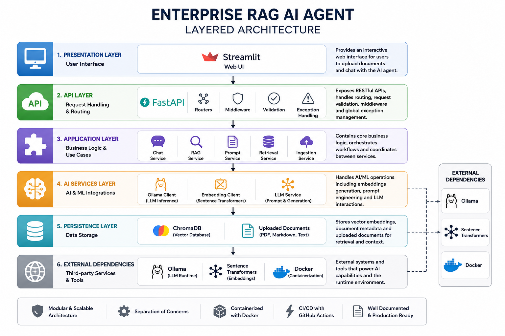
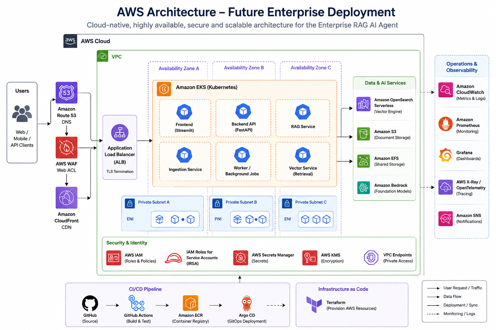

# 🤖 Enterprise AI Agent


An enterprise-grade Retrieval-Augmented Generation (RAG) AI assistant built with FastAPI, Streamlit, Ollama, ChromaDB, and Docker.

The project demonstrates how to build a modular AI application using clean architecture principles, local Large Language Models (LLMs), semantic search, document ingestion, and enterprise-ready software engineering practices.

---
# 🤖 Enterprise RAG AI Agent

> Enterprise-grade Retrieval-Augmented Generation (RAG) AI assistant built with FastAPI, Streamlit, Ollama, ChromaDB, Docker, and GitHub Actions.

---

## Table of Contents

- Features
- Architecture
- Technology Stack
- Project Structure
- RAG Pipeline
- Document Pipeline
- Screenshots
- Getting Started
- Docker Deployment
- API Documentation
- CI/CD Pipeline
- Future AWS Enhancements
- Skills Demonstrated
- License

---

## Features

...

---

## Architecture

### Layered Architecture



### Deployment Architecture


### AWS Improvement Roadmap



---

## Technology Stack

| Layer | Technology |
|--------|------------|
| Frontend | Streamlit |
| Backend | FastAPI |
| LLM | Ollama |
| Model | Llama 3.2 |
| Embeddings | Sentence Transformers |
| Vector Database | ChromaDB |
| DevOps | Docker |
| CI/CD | GitHub Actions |

---

## Project Structure

```text
...fix from here
# Features

* RAG (Retrieval-Augmented Generation)
* Local LLM using Ollama
* ChromaDB Vector Database
* Semantic Search with Sentence Transformers
* Multi-format Document Ingestion

  * TXT
  * Markdown
  * PDF
* File Upload API
* Automatic Embedding Generation
* Modular Layered Architecture
* FastAPI REST API
* Streamlit Web Interface
* Docker Support
* GitHub Actions CI Pipeline
* Logging and Global Exception Handling

---

# Technology Stack

## Backend

* FastAPI
* Python 3.12
* Uvicorn

## AI

* Ollama
* Llama 3.2
* Sentence Transformers
* ChromaDB

## Frontend

* Streamlit

## DevOps

* Docker
* Docker Compose
* GitHub Actions

---

# Project Structure

```text
backend/
    app/
        api/
        clients/
        core/
        loaders/
        models/
        rag/
        services/
        utils/

frontend/

data/

docs/

.github/
```

---

# Layered Architecture

Presentation Layer

↓

API Layer

↓

Application Layer

↓

RAG Services

↓

Data Layer

↓

Infrastructure Layer

This separation makes the application easy to maintain, extend, and test.

---

# RAG Pipeline

User Question

↓

Embedding Model

↓

Vector Search (ChromaDB)

↓

Relevant Context

↓

Prompt Construction

↓

Ollama (Llama 3.2)

↓

Answer

---

# Document Pipeline

Upload Document

↓

Document Loader

↓

Chunking

↓

Embedding Generation

↓

Vector Storage

↓

Semantic Search Ready

---

# Running Locally

Clone the repository.

Install dependencies.

Start Ollama.

Pull the Llama model.

Run the backend.

Run the frontend.

Or simply use Docker Compose.

---

# CI/CD

The project includes a GitHub Actions workflow that:

* Lints the application
* Builds Docker images
* Performs security scanning
* Pushes images to a container registry (configurable)

---

# Architecture Documentation

See the `docs/` directory for:

* Layered Architecture
* Deployment Architecture
* AWS Architecture Improvement

---

# Future Improvements

This application has intentionally been designed so it can be deployed to AWS with minimal changes.

Planned enterprise enhancements include:

* Amazon ECS (Fargate)
* Application Load Balancer
* Amazon ECR
* Amazon OpenSearch Serverless (Vector Engine)
* Amazon EFS for document storage
* AWS Secrets Manager
* Amazon CloudWatch
* GitHub Actions Continuous Deployment
* Infrastructure as Code using Terraform

The current architecture already follows the separation of concerns required for a cloud-native deployment, making the transition straightforward.

---

# Screenshots

Add screenshots of:

* Streamlit Interface
* Swagger UI
* Docker Compose
* Document Upload
* AI Responses

---

# Skills Demonstrated

* Python
* FastAPI
* Streamlit
* REST APIs
* Retrieval-Augmented Generation (RAG)
* Vector Databases
* ChromaDB
* Ollama
* LLM Integration
* Docker
* Docker Compose
* GitHub Actions
* Clean Architecture
* Software Design
* Enterprise Application Development

---

# License

MIT License.
